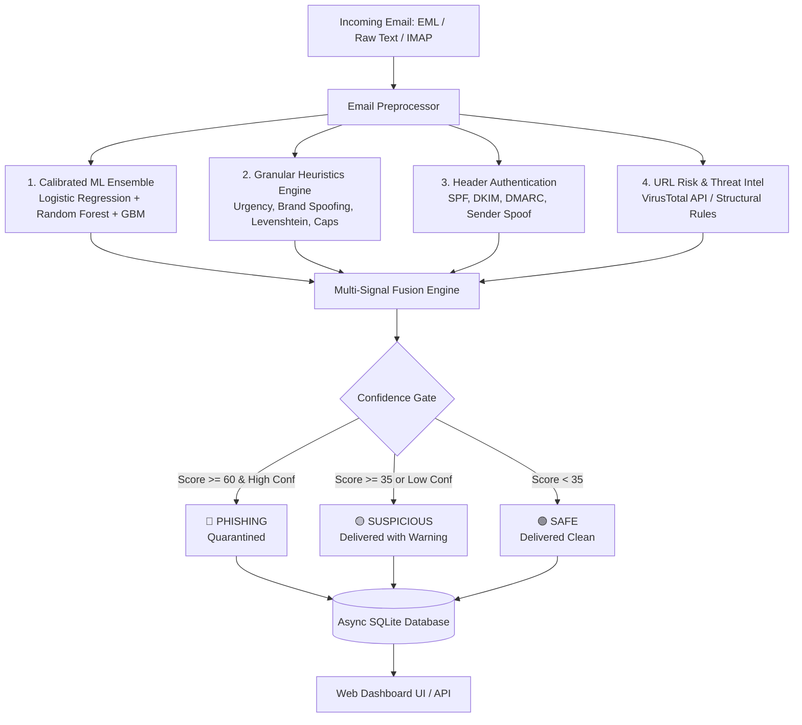

# ╔══════════════════════════════════════════════════════════════╗
# ║                 🛡️  PHISHGUARD AI                           ║
# ║         Advanced Phishing Detection & Mail Defense          ║
# ╚══════════════════════════════════════════════════════════════╝

An intelligent, multi-signal phishing detection engine that combines **calibrated ensemble machine learning**, **deep rule-based heuristics**, **email authentication analysis (SPF/DKIM/DMARC)**, and **real-time IMAP mailbox scanning** with an interactive dashboard.



---

## ✨ Key Features

| Feature | Description |
|---------|-------------|
| **Multi-Signal Fusion Engine** | Fuses 4 independent signal layers (ML, Heuristics, Header Auth, URL Risk) to produce a calibrated 0–100 threat score. |
| **Calibrated ML Ensemble** | TF-IDF text vectorization + metadata features with a Soft Voting Ensemble (`LogisticRegression` + `RandomForest` + `GradientBoosting`) calibrated via Isotonic Regression. |
| **Brand Spoofing & Lookalikes** | Levenshtein distance typosquatting detection + brand-in-subdomain impersonation inspection (e.g. `paypal.com.evil-site.xyz`). |
| **Urgency & Social Engineering** | Phrase dictionary matching with compounding cluster bonuses when multiple pressure keywords co-occur. |
| **Header Authentication** | Verifies `Authentication-Results`, `Received-SPF`, `DKIM-Signature`, `DMARC`, and sender display name / `Reply-To` mismatches. |
| **Interactive Glassmorphism Dashboard** | Modern, responsive web interface with live Chart.js statistics, threat breakdown chips, and audit trail. |
| **Drag & Drop .EML Upload** | Analyze complete raw `.eml` files with full multipart parsing, attachment risk inspection, and header verification. |
| **Quick Presets Bar** | 1-click sample email loader (PayPal Phish, Microsoft Alert, Dropbox Reset, Safe Meeting, Nigerian Prince) for instant testing. |
| **Model Retraining Panel** | Retrain the ML ensemble directly from the browser on synthetic data or upload your own CSV dataset. |
| **Background IMAP Mail Scanner** | Automated background mailbox polling via IMAP SSL with persistent UID message tracking and auto-quarantine. |
| **Async Database Audit Log** | Persistent SQLite storage using `aiosqlite` with WAL mode and transaction timeout protection. |
| **Automated Test Suite** | 100% passing test coverage with `pytest` and scoring benchmarks in `test_scores.py`. |

---

## 📁 Project Structure

```
phishing-analyzer/
├── main.py                  ← FastAPI application server & REST endpoints
├── src/
│   ├── analysis.py          ← Multi-signal scoring engine & confidence gating
│   ├── heuristics.py        ← Rule-based heuristics, brand spoofing & urgency checks
│   ├── model.py             ← Calibrated ML ensemble model training & inference
│   ├── preprocessing.py     ← MIME email parsing, URL/attachment extraction
│   ├── database.py          ← Async SQLite persistence (aiosqlite) with WAL mode
│   ├── mail_scanner.py      ← Background IMAP polling & quarantine engine
│   └── config.py            ← Tunable weights, thresholds, whitelists, and API keys
├── static/
│   ├── index.html           ← Modern dashboard UI (tabs, presets, dropzone)
│   ├── app.js               ← Frontend logic, Chart.js, polling & clipboard copy
│   └── style.css            ← Custom dark-mode glassmorphism design system
├── tests/
│   ├── __init__.py          ← Tests package marker
│   └── test_analyzer.py     ← Automated pytest test suite (14 test cases)
├── test_scores.py           ← Benchmark accuracy tests on 6 real-world scenarios
├── trained_model.joblib     ← Serialized ensemble pipeline
├── requirements.txt         ← Project dependencies
└── README.md                ← Project documentation
```

---

## 🚀 Quick Start

### 1. Prerequisites

- Python 3.10+ (tested on Python 3.10, 3.11, 3.12, 3.14)
- Git

### 2. Installation

```bash
# Clone the repository
git clone https://github.com/hackergovind/phishing-analyzer.git
cd phishing-analyzer

# Create and activate virtual environment (optional but recommended)
python -m venv .venv

# On Windows:
.venv\Scripts\activate

# On Linux/macOS:
# source .venv/bin/activate

# Install dependencies
pip install -r requirements.txt
```

### 3. Run the Application

```bash
python main.py
```

- **Dashboard UI**: [http://127.0.0.1:8000](http://127.0.0.1:8000)
- **Interactive Swagger Docs**: [http://127.0.0.1:8000/docs](http://127.0.0.1:8000/docs)
- **ReDoc API Spec**: [http://127.0.0.1:8000/redoc](http://127.0.0.1:8000/redoc)

---

## 🧪 Testing & Verification

### Run Automated Unit Tests (pytest)

```bash
pytest tests/ -v
```

All 14 tests will run across preprocessing, heuristics, ML inference, database CRUD, and FastAPI endpoints:

```
tests/test_analyzer.py::test_parse_raw_text_basic PASSED                 [  7%]
tests/test_analyzer.py::test_parse_raw_text_with_headers PASSED          [ 14%]
tests/test_analyzer.py::test_parse_email_eml_bytes PASSED                [ 21%]
tests/test_analyzer.py::test_heuristics_urgency_and_social_engineering PASSED [ 28%]
tests/test_analyzer.py::test_heuristics_brand_impersonation_in_subdomain PASSED [ 35%]
tests/test_analyzer.py::test_heuristics_excessive_caps PASSED            [ 42%]
tests/test_analyzer.py::test_ml_model_predict_proba PASSED               [ 50%]
tests/test_analyzer.py::test_analyze_obvious_phishing PASSED             [ 57%]
tests/test_analyzer.py::test_analyze_safe_email PASSED                   [ 64%]
tests/test_analyzer.py::test_database_operations PASSED                  [ 71%]
tests/test_analyzer.py::test_api_health PASSED                           [ 78%]
tests/test_analyzer.py::test_api_analyze_text PASSED                     [ 85%]
tests/test_analyzer.py::test_api_analyze_eml PASSED                      [ 92%]
tests/test_analyzer.py::test_api_stats_and_results PASSED                [100%]
============================== 14 passed in 8.52s ===============================
```

### Run Benchmark Accuracy Tests

```bash
python test_scores.py
```

Expected output:

```
======================================================================
SUMMARY TABLE
======================================================================
Test                                        Score       Status     Expected   OK?
----------------------------------------------------------------------
1. Obvious PayPal Phishing                   75.8     Phishing     Phishing  PASS
2. Microsoft Phishing                        75.2     Phishing     Phishing  PASS
3. Credential Harvesting                     77.4     Phishing     Phishing  PASS
4. Safe Meeting Email                         9.1         Safe         Safe  PASS
5. Subtle Dropbox Phishing                   42.9   Suspicious   Suspicious  PASS
6. Nigerian Prince Scam                      35.6   Suspicious   Suspicious  PASS
```

---

## 📡 REST API Reference

### 1. Analyze Raw Email Text
**`POST /analyze/text`**

```bash
curl -X POST http://127.0.0.1:8000/analyze/text \
  -F "text=URGENT: Your PayPal account has been suspended! Verify here: http://paypa1.com.malicious.top/secure"
```

**Response (`200 OK`):**
```json
{
  "status": "Phishing",
  "action": "QUARANTINED — Blocked from user inbox.",
  "threat_score": 75.8,
  "confidence": 0.9,
  "breakdown": {
    "ml_score": 35.0,
    "heuristic_score": 30.0,
    "header_auth": 6.75,
    "url_risk": 4.0,
    "whitelist_offset": 0.0
  },
  "evidence": [
    { "source": "ML Ensemble", "detail": "Phishing probability: 100.00%", "contribution": 35.0 },
    { "source": "Heuristic: urgency:phrase", "detail": "Found: \"unauthorized access\" (body)", "contribution": 5.4 },
    { "source": "Heuristic: urgency:cluster", "detail": "7 urgency phrases detected (cluster bonus)", "contribution": 4.5 }
  ]
}
```

### 2. Analyze Raw EML File
**`POST /analyze`**

```bash
curl -X POST http://127.0.0.1:8000/analyze \
  -F "file=@suspicious_message.eml"
```

### 3. Retrain Model
**`POST /train`**

```bash
# Retrain on built-in synthetic balanced dataset:
curl -X POST http://127.0.0.1:8000/train

# Retrain on custom CSV:
curl -X POST http://127.0.0.1:8000/train \
  -F "file=@custom_dataset.csv"
```

### 4. Health Check
**`GET /health`**

```bash
curl http://127.0.0.1:8000/health
```
```json
{
  "status": "ok",
  "model_trained": true,
  "version": "2.0.0"
}
```

### 5. Get Aggregate Statistics
**`GET /api/stats`**

```bash
curl http://127.0.0.1:8000/api/stats
```

### 6. Get Recent Scan History
**`GET /api/results?limit=20&offset=0`**

```bash
curl http://127.0.0.1:8000/api/results?limit=20
```

---

## 📬 IMAP Mail Scanner Setup

The IMAP background scanner continuously monitors an inbox for new messages, analyzes each incoming email, logs the verdict to the database, and automatically moves emails flagged as **Phishing** into a dedicated quarantine folder.

### Configuration via Dashboard or API:

```bash
curl -X POST http://127.0.0.1:8000/api/mail/connect \
  -H "Content-Type: application/json" \
  -d '{
    "imap_host": "imap.gmail.com",
    "imap_port": 993,
    "email": "your-email@gmail.com",
    "password": "your-16-character-app-password",
    "folder": "INBOX",
    "poll_interval": 30
  }'
```

> [!IMPORTANT]
> **Gmail Configuration**: Regular account passwords will be rejected by Google. You must generate an **App Password**:
> 1. Go to your [Google Account Security Settings](https://myaccount.google.com/security).
> 2. Ensure **2-Step Verification** is enabled.
> 3. Go to [App Passwords](https://myaccount.google.com/apppasswords) and create a password for "Mail".
> 4. Enter the 16-character password into PhishGuard AI.

---

## ⚙️ Environment Variables & Tuning

All parameters can be set in your environment or tuned in [`src/config.py`](src/config.py):

| Variable / Setting | Default | Description |
|--------------------|---------|-------------|
| `VIRUSTOTAL_API_KEY` | `""` | Optional VirusTotal v3 API key for live URL reputation queries |
| `WEIGHT_ML_SCORE` | `35.0` | Maximum contribution from the ensemble ML classifier |
| `WEIGHT_HEURISTIC_SCORE` | `30.0` | Maximum contribution from the heuristics engine |
| `WEIGHT_HEADER_AUTH` | `15.0` | Maximum contribution from email authentication failures |
| `WEIGHT_URL_RISK` | `20.0` | Maximum contribution from URL structural risk analysis |
| `THRESHOLD_SUSPICIOUS` | `35.0` | Threat score threshold for flagging as Suspicious |
| `THRESHOLD_PHISHING` | `60.0` | Threat score threshold for classifying as Phishing |
| `CONFIDENCE_FLOOR_FOR_PHISHING` | `0.60` | Minimum confidence required to Quarantine (prevents false positives) |
| `WHITELIST_TRUST_OFFSET` | `-25.0` | Trust discount for authenticated whitelisted domains |

---

## 🛡️ Responsible Disclosure & License

This software is developed for authorized defense, security awareness training, and academic analysis.
Distributed under the **MIT License**.

