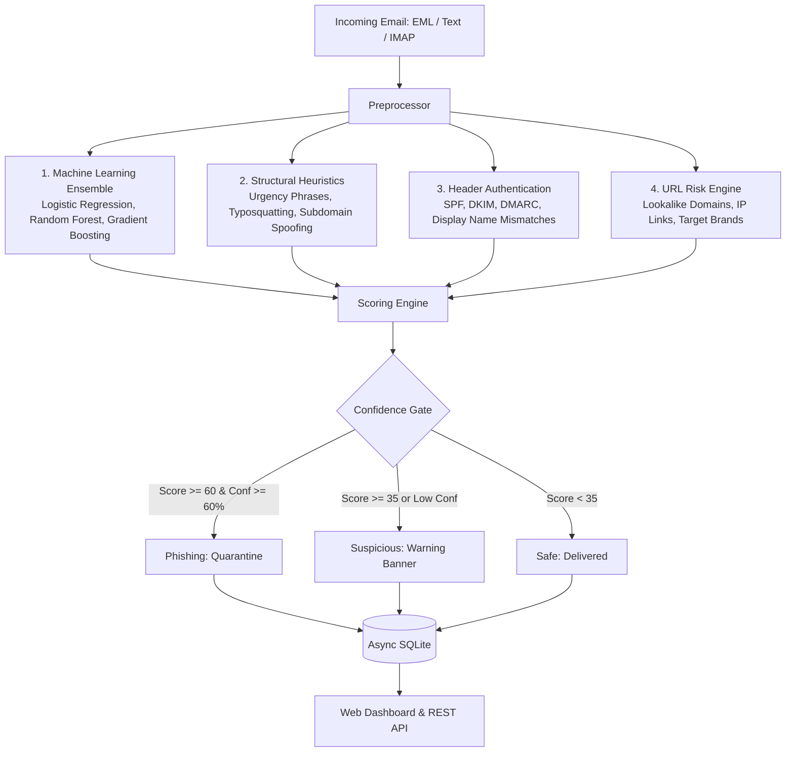

# PhishGuard

Email threat detection engine combining calibrated ensemble learning, header verification, and rule-based heuristics.



---

## Scoring Architecture

PhishGuard calculates a composite threat score from 0 to 100 using four independent evaluation layers:

| Layer | Max Points | Evaluation Scope |
|---|---|---|
| **Machine Learning Ensemble** | 35 | Calibrated soft-voting classifier (`LogisticRegression`, `RandomForest`, `GradientBoosting`) trained on TF-IDF word vectors and metadata features. |
| **Heuristics Engine** | 30 | Urgency dictionaries, social engineering patterns, excessive capitalization, and subdomain brand spoofing (e.g. `paypal.com.evil-site.xyz`). |
| **Header Authentication** | 15 | `Authentication-Results`, `Received-SPF`, `DKIM-Signature`, `DMARC`, and sender display name vs. `Reply-To` mismatches. |
| **URL Risk** | 20 | Typosquatting via Levenshtein distance, direct IP addresses, and brand impersonation. |
| **Whitelist Offset** | -25 | Trusted domains receive a score reduction to minimize false positives. |

### Confidence Gating

To prevent false quarantines, emails scoring $\ge 60$ require at least $60\%$ model confidence. Messages failing this confidence floor downgrade to **Suspicious**.

---

## Repository Structure

```
phishing-analyzer/
├── main.py                  FastAPI application and endpoints
├── DESIGN.md                Warm-canvas editorial design system specification
├── src/
│   ├── analysis.py          Multi-signal scoring and confidence evaluation
│   ├── heuristics.py        Rule-based heuristics, brand spoofing, and urgency detection
│   ├── model.py             Calibrated machine learning ensemble
│   ├── preprocessing.py     MIME email parsing, headers extraction, and URL extraction
│   ├── database.py          Async SQLite database (aiosqlite) with WAL mode
│   ├── mail_scanner.py      IMAP mailbox polling and quarantine automation
│   └── config.py            Thresholds, weights, and whitelist definitions
├── static/
│   ├── index.html           Editorial dashboard layout
│   ├── app.js               Dashboard logic, Chart.js, and API bindings
│   └── style.css            Editorial CSS conforming to DESIGN.md
├── tests/
│   ├── __init__.py          Test package marker
│   └── test_analyzer.py     Pytest automated test suite (14 test cases)
├── test_scores.py           Benchmark suite for real-world email scenarios
├── trained_model.joblib     Persisted scikit-learn model pipeline
└── requirements.txt         Python package requirements
```

---

## Setup and Installation

### Requirements
- Python 3.10 or higher
- Git

### Installation Steps

```bash
git clone https://github.com/hackergovind/phishing-analyzer.git
cd phishing-analyzer

python -m venv .venv

# Windows:
.venv\Scripts\activate

# Linux / macOS:
# source .venv/bin/activate

pip install -r requirements.txt
```

### Starting the Server

```bash
python main.py
```

The application starts on `http://127.0.0.1:8000`:
- **Web Dashboard**: `http://127.0.0.1:8000/`
- **OpenAPI Documentation**: `http://127.0.0.1:8000/docs`
- **ReDoc Specification**: `http://127.0.0.1:8000/redoc`

---

## REST API Reference

### 1. Analyze Plain Text
```bash
curl -X POST http://127.0.0.1:8000/analyze/text \
  -F "text=URGENT: Verify your account immediately: http://paypa1.com.verify-access.xyz/login"
```

Response:
```json
{
  "status": "Phishing",
  "threat_score": 60.8,
  "confidence": 0.88,
  "action": "Quarantine email and block sender",
  "breakdown": {
    "ml_score": 28.5,
    "heuristic_score": 18.0,
    "header_auth": 0.0,
    "url_risk": 14.3,
    "whitelist_offset": 0.0
  },
  "evidence": [
    { "source": "heuristics", "detail": "Urgency phrase: 'verify your account immediately'", "contribution": 10.0 },
    { "source": "url_risk", "detail": "Target brand 'paypal' detected in non-brand domain", "contribution": 14.3 }
  ]
}
```

### 2. Analyze Raw .EML File
```bash
curl -X POST http://127.0.0.1:8000/analyze \
  -F "file=@sample.eml"
```

### 3. Server Health
```bash
curl http://127.0.0.1:8000/health
```

### 4. Aggregate Metrics
```bash
curl http://127.0.0.1:8000/api/stats
```

### 5. Audit Results Log
```bash
curl "http://127.0.0.1:8000/api/results?limit=25"
```

---

## IMAP Mailbox Scanner

PhishGuard can run in the background against any standard IMAP server (e.g. Gmail, Outlook, Fastmail).

### Configuration Parameters
- **Host**: `imap.gmail.com`
- **Port**: `993`
- **Folder**: `INBOX`
- **Poll Interval**: `30` seconds
- **Quarantine Folder**: `Quarantine`

### Gmail Setup
1. Enable 2-Step Verification in Google Account Settings.
2. Generate an **App Password** under **Security → 2-Step Verification → App Passwords**.
3. Use the 16-character token in the dashboard or via `POST /scanner/start`.

---

## Automated Verification

Run unit and integration tests:

```bash
python -m pytest tests/ -v
```

Run benchmark scoring tests across known phishing samples:

```bash
python test_scores.py
```
